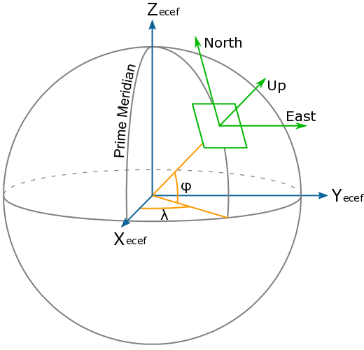

# GPS-Arduino
Permet d'afficher les coordonnées ENU (East, North, Up) en mètres sur écran LCD en faisant référence 
à un point géographique identifié à partir de sa longitude et latitude. 
Matériel Requis : Un Arduino relié à un écran LCD 162C BA BC et à un GPS NEO6MV2 par liaison série

Le code source pour microcontroleur Arduino décrit dans cette section permet de calculer la 
position relative du robot tondeuse en coordonnées cartésiennes X,Y,Z après avoir pris pour 
référence à un point géographique situé dans le jardin.

La position relative de la tondeuse X,Y,Z est décrite dans un repère local où
* l'axe X est dirigé vers l'est,
* l'axe Y est dirigé vers le nord,
* l'axe Z est dirigé vers le nord.

Ce repère local est aussi appelé ENU (East, North, Up). 
Le point de coordonnées 0,0 dans le repère dit local correspond au point de référence situé dans le jardin.

Parès avoir défini un point de référence dans le jardin à partir de ses coordonnées exprimées en longitude 
et latitude, l'obtention de la position relative dans ce repère local, il est nécessaire d'avoir réalisé les étapes suivantes :

* Avoir récupéré les coordonnées GPS de la tondeuse (longitude, latitude) à partir d'un module GPS relié 
à l'arduino via une connexion série à 9600 bits par seconde,
* Avoir transformé les coordonnées GPS de la tondeuse (longitude, latitude) en coordonnées cartésienne 
de type X,Y,Z dans un repère ECEF ("earth-centered, earth-fixed"),
* Avoir convertit les coordonnées X,Y,Z de la tondeuse en coordonnées de type ENU (East, North, Up) depuis 
le point de référence du jardin

La position X,Y est ensuite affichée sur l'écran LCD connecté à l'arduino via une liaison série à 19200 bits par seconde.
